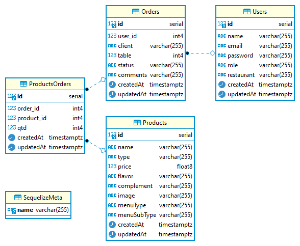

# Acka Burger API

## Índice

* [1. Apresentação do Projeto](#1-apresentação-do-projeto)
* [2. Utilizando a API](#2-utilizando-a-API)
* [3. Estrutura do Banco de Dados](#3-estrutura-do-banco-de-dados)
* [4. Ferramentas Utilizadas](#4-ferramentas-utilizadas)
* [5. Considerações Finais](#5-considerações-finais)
* [6. Desenvolvedora](#6-desenvolvedora)

## 1. Apresentação do Projeto

Neste projeto desenvolvemos uma _API rest_ que deve ser compatível com as requisições feitas pelo Front-End (interface desenvolvida no projeto [Acka Burger](https://acka-burger.vercel.app/).

No projeto deverá conter os seguintes _endpoints_:

### 1.1 `/users`
* `GET /users`
* `GET /users/:uid`
* `POST /users`
* `PUT /users/:uid`
* `DELETE /users/:uid`

### 1.2 `/products`

* `GET /products`
* `GET /products/:productid`
* `POST /products`
* `PUT /products/:productid`
* `DELETE /products/:productid`

### 1.3 `/orders`

* `GET /orders`
* `GET /orders/:orderId`
* `POST /orders`
* `PUT /orders/:orderId`
* `DELETE /orders/:orderId`

## 2. Utilizando a API

Deseja testar o _endpoints_ acima?
Para isso recomendo ler a documentação da _API_ para verificar as informações necessárias para fazer uma requisição no link: [Acka Burger - API](https://bq-acka-burger.herokuapp.com/).

## 3. Estrutura do Banco de Dados

Nesse projeto nosso maior desafio foi entender como estrutura um Banco de Dados, e quais interações entre tabelas necessitaríamos desenvolver para que as requisições funcionassem de maneira simples e eficaz.

Abaixo a imagem da estrutura do Banco de dados.
 

  

## 4. Ferramentas Utilizadas

- [x] **Node.js**
- [x] **Express**
- [x] **Sequelize**
- [x] **Heroku** (Hospedagem)
- [x] **PostgreSQL** (Gerenciador de Banco de Dados)
- [x] **Postman** (Testes de requisições)
- [x] **Dbeaver** (Visualização e administração do Banco de Dados)
- [x] **Swagger UI** (Documentação da API)
- [x] **VsCode**
- [x] **GitHub**

## 5. Considerações Finais

Esse projeto nos trouxe um desafio diferente dos demais, estávamos acostumadas a desenvolver Front-End, ter uma interface para interação Homem-máquina.

O Back-End sempre foi uma parte da programação muito obscura para mim, e no decorrer do desenvolvimento desse projeto pude aprender muita coisa e me aprimorar ainda mais como Desenvolvedora. 

Porém tudo isso não teria acontecido sem enorme apoio e incentivo das minhas **amigas de código** que não duvidaram nenhum segundo da minha capacidade de aprendizagem e adaptação.
E por isso dedico esse projeto a elas, [Ana Clara](https://github.com/anaclara-gf), [Akemi](https://github.com/akemimeka), [Beatriz](https://github.com/beatrizpenalva), [Camila](https://github.com/cbalieiro), [Caroline](https://github.com/CarolineSCosta), [Cristina](https://github.com/crismantovani), [Dunia](https://github.com/dunia07), [Gabriela](https://github.com/gabrielasilva1991) e [Laura](https://github.com/LauraDeperon).

O apoio de vocês foi fundamental para a entrega desse projeto. **Obrigada!**

## 6. Desenvolvedora

Aplicação desenvolvida por **[Kauana Maria Agostini](www.linkedin.com/in/kauanaagostini)**
